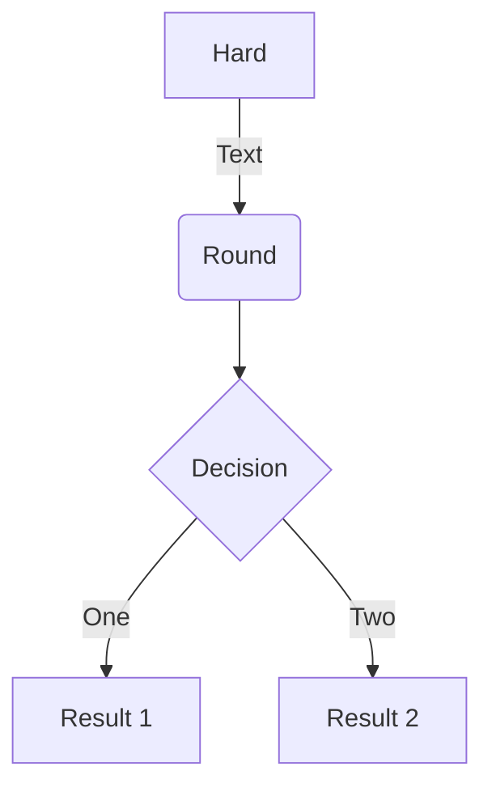
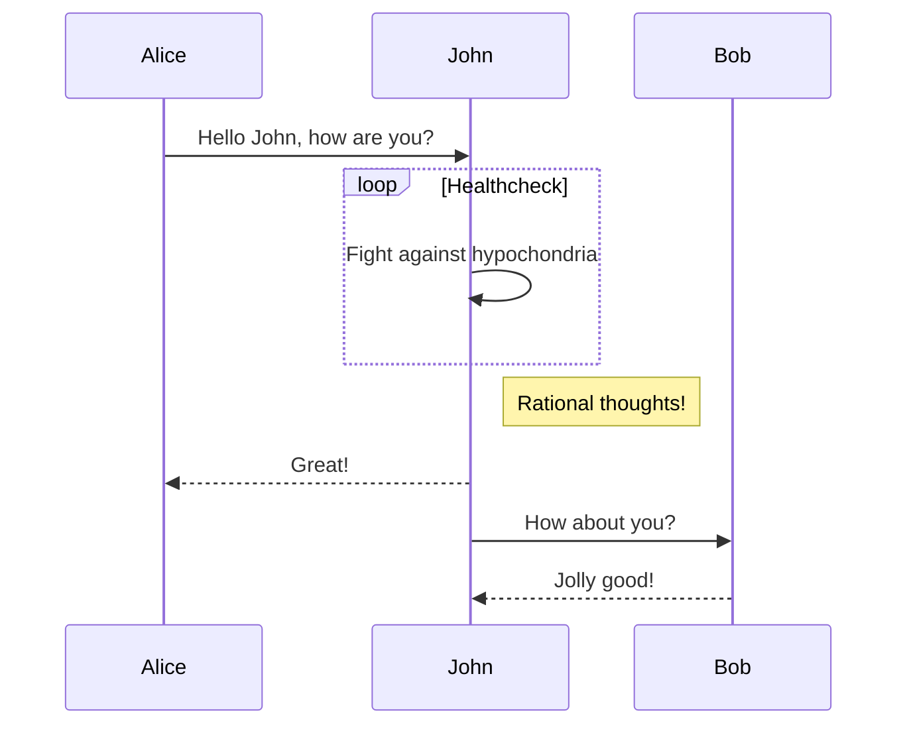
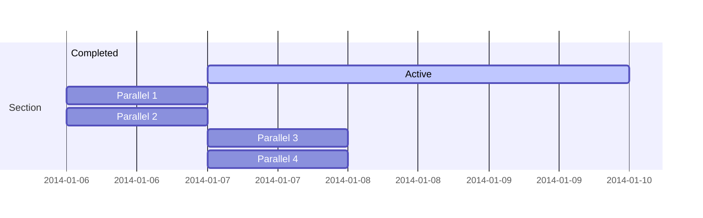
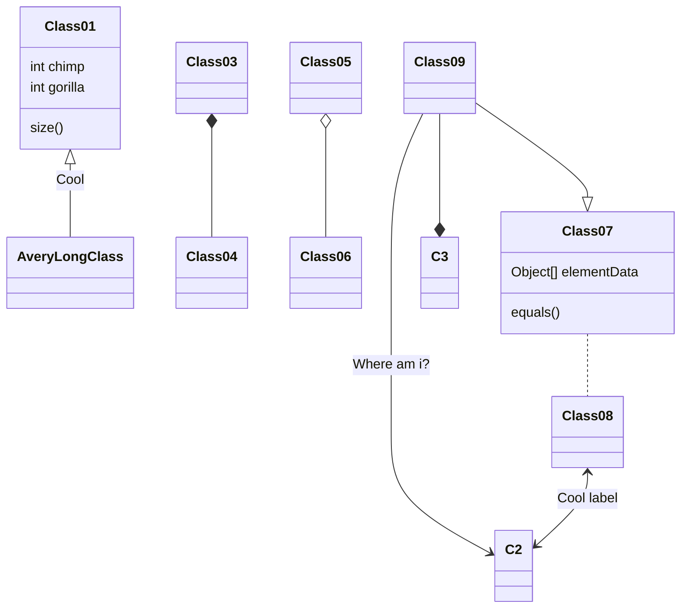
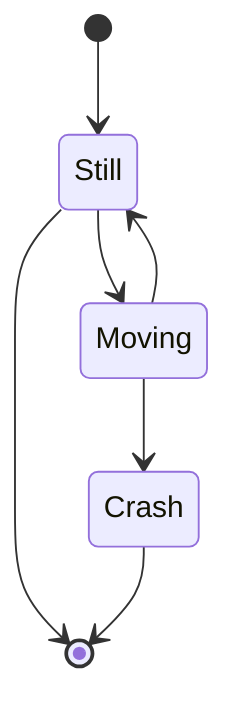

## Issue description

Assignee: wilkinsona 

We believe that circular references between beans should be avoided if at all possible. To help users avoid accidentally creating such dependency cycles, we should configure the ``BeanFactory`` to prohibit circular references by default. We'll allow them to be enabled via API and configuration property for those that really need them, as we did with bean definition overriding in 2.1. We should also update ``ApplicationContextRunner`` at the same time.

**首先，这个issue是关于bean的循环引用问题，讨论里面主要涉及到bean的自我依赖（self-injection）问题，wilkinsona说自我依赖问题应该尽可能的避免，并且配置BeanFactory默认禁止循环依赖，如果有需求的话通过API和配置文件使循环依赖生效。
但是，bmaehr说自我依赖是一个很常见的现象，因为很多时候需要在内部调用时使用spring的注解例如`` @Cacheable``, ``@transactional``, ``@retryable``，如果自我依赖被默认禁用了，需要有一个更普适性的方法去解决这个问题。bennettdams说可以使用``@Lazy``注解来避免自我依赖问题，并且提出让spring团队
在docs里面补充demo来提供解决自我依赖问题的最佳实践。 Majstr说在平常业务开发中会经常遇到两个bean互相引用的问题。 jonenst说如果只是为了让一个bean能够自我依赖就全局修改配置文件的``spring.main.allow-circular-references``属性
是不可取的。**


## Examples

### Self-injection

这是一个自我依赖的例子，``MyBean``类里面注入了自己，这样的话在初始化阶段会报错，因为默认情况下spring禁止bean的循环依赖。

```java
@Component
public class MyBean {
@Autowired
private MyBean self;  // 自己引用自己
}
```

### Internal method calls

自我依赖为什么是一个常见的现象呢？因为很多时候需要在内部调用时使用spring的注解例如`` @Cacheable``, ``@transactional``, ``@retryable``，这些注解都是通过AOP实现的，所以在内部调用的时候需要使用spring的注解，这样的话就会出现自我依赖的问题。

```java
@Component
public class MyBean {
  @Autowired
  private MyBean self;

  @PostConstruct
  public void init() {
    // 在初始化阶段内部调用自己的方法
    self.internalMethod();
  }

  @Transactional
  public void internalMethod() {
    // 使用Spring的注解进行内部方法调用
    // ...
  }
}
```

### Circular references

循环依赖的问题，在准备面试的时候看到过这个问题，但是没有深入研究过，这里简单的记录一下。

1. 什么是循环依赖？

循环依赖就是A依赖B，B依赖A，这样的话就会形成一个循环依赖的问题。

```java
@Component
public class A {
  // A中注入了B
  @Autowired
  private B b;
}

@Component
public class B {
  // B中也注入了A
  @Autowired
  private A a;
}
```

2. spring是如何解决循环依赖的问题。这个问题可以参考 面试必杀技，讲一讲Spring中的循环依赖[https://developer.aliyun.com/article/766880]

其中提到循环依赖能被解决的前提条件是：（1）**循环依赖的bean必须是单例的**，这个好理解，因为单例的bean在spring容器初始化的时候就会被创建，所以spring可以在创建bean的时候将其放入缓存中，这样的话就可以解决循环依赖的问题。（2）依赖注入的方式不能全是构造器注入的方式，因为构造器注入的方式是在bean创建的时候就会调用构造器，这样的话就会导致两个bean都获取不到对方的实例，所以出现循环依赖问题。
不能全是构造器构造器注入的方式，那么就是说可以有一部分是构造器，一部分是setter注入的方式，这样的话就可以解决循环依赖的问题。

```java

### Mindmaps


renders as

```markmap {height="200px"}
- Hugo Modules
  - wowchemy
  - wowchemy-plugins-netlify
  - wowchemy-plugins-netlify-cms
  - wowchemy-plugins-reveal
```

A more advanced mindmap with formatting, code blocks, and math:

<div class="highlight">
<pre class="chroma">
<code>
```markmap
- Mindmaps
  - Links
    - [Wowchemy Docs](https://wowchemy.com/docs/)
    - [Discord Community](https://discord.gg/z8wNYzb)
    - [GitHub](https://github.com/wowchemy/wowchemy-hugo-themes)
  - Features
    - Markdown formatting
    - **inline** ~~text~~ *styles*
    - multiline
      text
    - `inline code`
    -
      ```js
      console.log('hello');
      console.log('code block');
      ```
    - Math: $x = {-b \pm \sqrt{b^2-4ac} \over 2a}$
```
</code>
</pre>
</div>

renders as

```markmap
- Mindmaps
  - Links
    - [Wowchemy Docs](https://wowchemy.com/docs/)
    - [Discord Community](https://discord.gg/z8wNYzb)
    - [GitHub](https://github.com/wowchemy/wowchemy-hugo-themes)
  - Features
    - Markdown formatting
    - **inline** ~~text~~ *styles*
    - multiline
      text
    - `inline code`
    -
      ```js
      console.log('hello');
      console.log('code block');
      ```
    - Math: $x = {-b \pm \sqrt{b^2-4ac} \over 2a}$
```

### Charts

Wowchemy supports the popular [Plotly](https://plot.ly/) format for interactive charts.

Save your Plotly JSON in your page folder, for example `line-chart.json`, and then add the `` shortcode where you would like the chart to appear.

Demo:



You might also find the [Plotly JSON Editor](http://plotly-json-editor.getforge.io/) useful.

### Math

Wowchemy supports a Markdown extension for $\LaTeX$ math. You can enable this feature by toggling the `math` option in your `config/_default/params.yaml` file.

To render _inline_ or _block_ math, wrap your LaTeX math with `$...$` or `$$...$$`, respectively. (We wrap the LaTeX math in the Wowchemy _math_ shortcode to prevent Hugo rendering our math as Markdown. The _math_ shortcode is new in v5.5-dev.)

Example **math block**:

```latex

$$
\gamma_{n} = \frac{ \left | \left (\mathbf x_{n} - \mathbf x_{n-1} \right )^T \left [\nabla F (\mathbf x_{n}) - \nabla F (\mathbf x_{n-1}) \right ] \right |}{\left \|\nabla F(\mathbf{x}_{n}) - \nabla F(\mathbf{x}_{n-1}) \right \|^2}
$$

```

renders as


$$\gamma_{n} = \frac{ \left | \left (\mathbf x_{n} - \mathbf x_{n-1} \right )^T \left [\nabla F (\mathbf x_{n}) - \nabla F (\mathbf x_{n-1}) \right ] \right |}{\left \|\nabla F(\mathbf{x}_{n}) - \nabla F(\mathbf{x}_{n-1}) \right \|^2}$$


Example **inline math** `$\nabla F(\mathbf{x}_{n})$` renders as $\nabla F(\mathbf{x}_{n})$.

Example **multi-line math** using the math linebreak (`\\`):

```latex

$$f(k;p_{0}^{*}) = \begin{cases}p_{0}^{*} & \text{if }k=1, \\
1-p_{0}^{*} & \text{if }k=0.\end{cases}$$

```

renders as



$$
f(k;p_{0}^{*}) = \begin{cases}p_{0}^{*} & \text{if }k=1, \\
1-p_{0}^{*} & \text{if }k=0.\end{cases}
$$



### Diagrams

Wowchemy supports a Markdown extension for diagrams. You can enable this feature by toggling the `diagram` option in your `config/_default/params.toml` file or by adding `diagram: true` to your page front matter.

An example **flowchart**:

    ```mermaid
    graph TD
    A[Hard] -->|Text| B(Round)
    B --> C{Decision}
    C -->|One| D[Result 1]
    C -->|Two| E[Result 2]
    ```

renders as



An example **sequence diagram**:

    ```mermaid
    sequenceDiagram
    Alice->>John: Hello John, how are you?
    loop Healthcheck
        John->>John: Fight against hypochondria
    end
    Note right of John: Rational thoughts!
    John-->>Alice: Great!
    John->>Bob: How about you?
    Bob-->>John: Jolly good!
    ```

renders as



An example **Gantt diagram**:

    ```mermaid
    gantt
    section Section
    Completed :done,    des1, 2014-01-06,2014-01-08
    Active        :active,  des2, 2014-01-07, 3d
    Parallel 1   :         des3, after des1, 1d
    Parallel 2   :         des4, after des1, 1d
    Parallel 3   :         des5, after des3, 1d
    Parallel 4   :         des6, after des4, 1d
    ```

renders as



An example **class diagram**:

    ```mermaid
    classDiagram
    Class01 <|-- AveryLongClass : Cool
    Class03 *-- Class04
    Class05 o-- Class06
    Class07 .. Class08
    Class09 --> C2 : Where am i?
    Class09 --* C3
    Class09 --|> Class07
    Class07 : equals()
    Class07 : Object[] elementData
    Class01 : size()
    Class01 : int chimp
    Class01 : int gorilla
    Class08 <--> C2: Cool label
    ```

renders as



An example **state diagram**:

    ```mermaid
    stateDiagram
    [*] --> Still
    Still --> [*]
    Still --> Moving
    Moving --> Still
    Moving --> Crash
    Crash --> [*]
    ```

renders as



### Todo lists

You can even write your todo lists in Markdown too:

```markdown
- [x] Write math example
  - [x] Write diagram example
- [ ] Do something else
```

renders as

- [x] Write math example
  - [x] Write diagram example
- [ ] Do something else

### Tables

Save your spreadsheet as a CSV file in your page's folder and then render it by adding the _Table_ shortcode to your page:

```go

```

renders as



### Callouts

Academic supports a [shortcode for callouts](https://wowchemy.com/docs/content/writing-markdown-latex/#callouts), also referred to as _asides_, _hints_, or _alerts_. By wrapping a paragraph in `{} ... {}`, it will render as an aside.

```markdown
{}
A Markdown aside is useful for displaying notices, hints, or definitions to your readers.
{}
```

renders as

{}
A Markdown aside is useful for displaying notices, hints, or definitions to your readers.
{}

### Spoilers

Add a spoiler to a page to reveal text, such as an answer to a question, after a button is clicked.

```markdown

You found me!

```

renders as

 You found me! 

### Icons

Academic enables you to use a wide range of [icons from _Font Awesome_ and _Academicons_](https://wowchemy.com/docs/getting-started/page-builder/#icons) in addition to [emojis](https://wowchemy.com/docs/content/writing-markdown-latex/#emojis).

Here are some examples using the `icon` shortcode to render icons:

```markdown
 Terminal  
 Python  
 R
```

renders as

 Terminal  
 Python  
 R

### Did you find this page helpful? Consider sharing it 🙌
